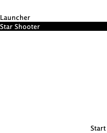

# Space Asteroids (J2ME)

Space Asteroids (J2ME) — короткий аркадный шутер про полёт сквозь звёздный поток.
Веди корабль, уклоняйся от вращающихся астероидов трёх размеров и сбивай их выстрелами, набирая очки. Столкновение — Game Over.

Управление: ←/→ — движение, FIRE/ОК — выстрел.
Цель — продержаться как можно дольше и установить рекорд.

Для самостоятельного запуска в эмуляторе:

1) Скачать IntelliJ Idea - https://www.jetbrains.com/ru-ru/idea/download/
2) В идее в File -> Project Structure -> SDK -> скачать JDK 1.8
3) В разделе плагинов Settings -> Plugins скачать систему сборки Ant
4) После установки включить показ в боковом меню View -> Tool Windows -> Ant
5) Открыть сборшик проекта Ant и выбрать цель run-jar
